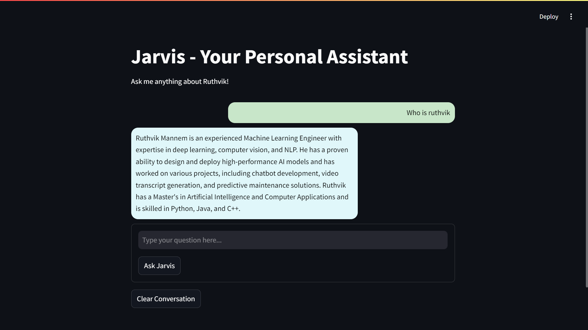

# Jarvis - Ruthvik's Personal Assistant

Jarvis is a personal assistant chatbot that leverages Cohere's language model and LangChain to answer questions based on Ruthvik's resume. It also supports conversational interactions, providing a personalized assistant experience.



## Features
- Extracts information from a PDF document (e.g., a resume) using FAISS for document similarity search.
- Answers questions about Ruthvik's skills, background, and other relevant topics.
- Uses Cohere's API for generating natural language responses.
- Built using Streamlit for a user-friendly interface.


## Prerequisites

1. **Python 3.7+** must be installed. You can download it from [here](https://www.python.org/downloads/).
2. **Cohere API Key**: You will need an API key from Cohere. Sign up [here](https://cohere.com/) and get your API key.

## Installation

1. Clone the repository:
    ```bash
    git clone https://github.com/yourusername/chatbot.git
    cd chatbot
    ```

2. Create and activate a virtual environment (optional but recommended):
    ```bash
    # Create a virtual environment
    python -m venv venv

    # Activate the virtual environment (Windows)
    venv\Scripts\activate

    # Activate the virtual environment (macOS/Linux)
    source venv/bin/activate
    ```

3. Install the required packages:
    ```bash
    pip install -r requirements.txt
    ```

4. Create a `.env` file in the root directory and add your Cohere API key:
    ```
    COHERE_API_KEY=your_cohere_api_key_here
    ```

5. Do not commit the `.env` file to your repository. Make sure it is listed in `.gitignore`.

## Usage

To start the Streamlit app, run the following command in the terminal:

```bash
streamlit run app.py
